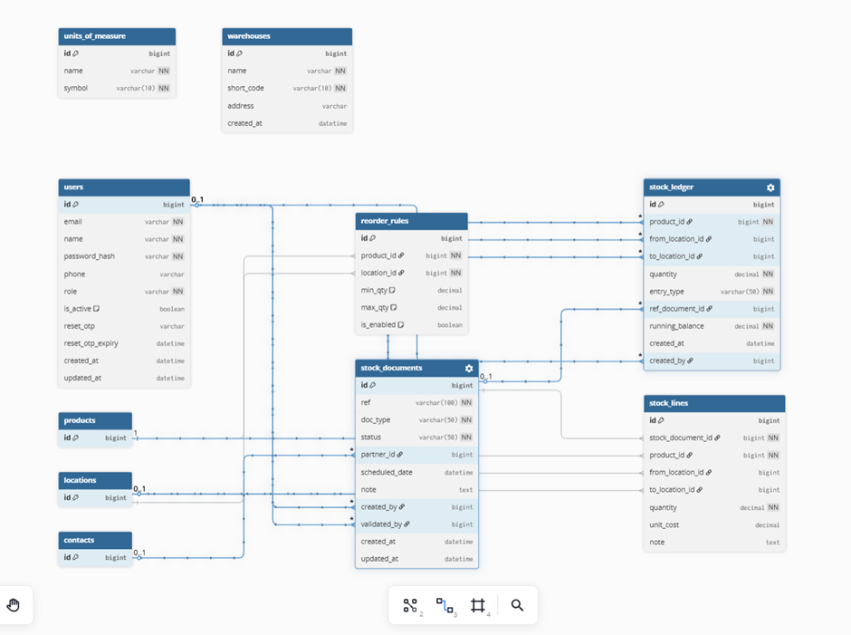
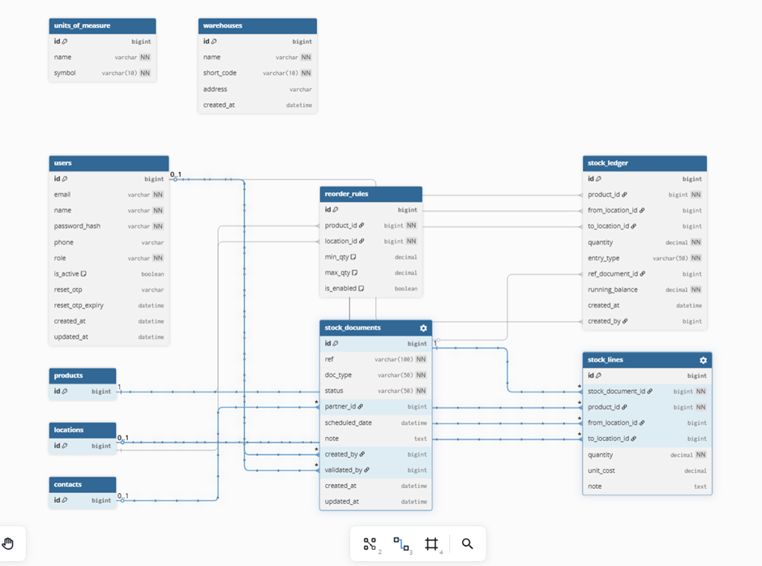
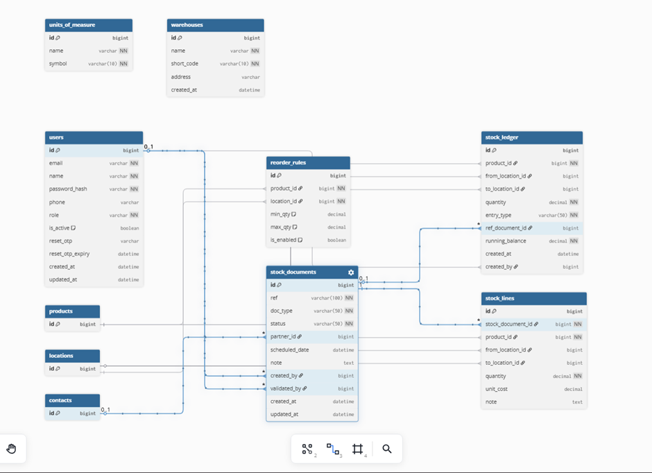
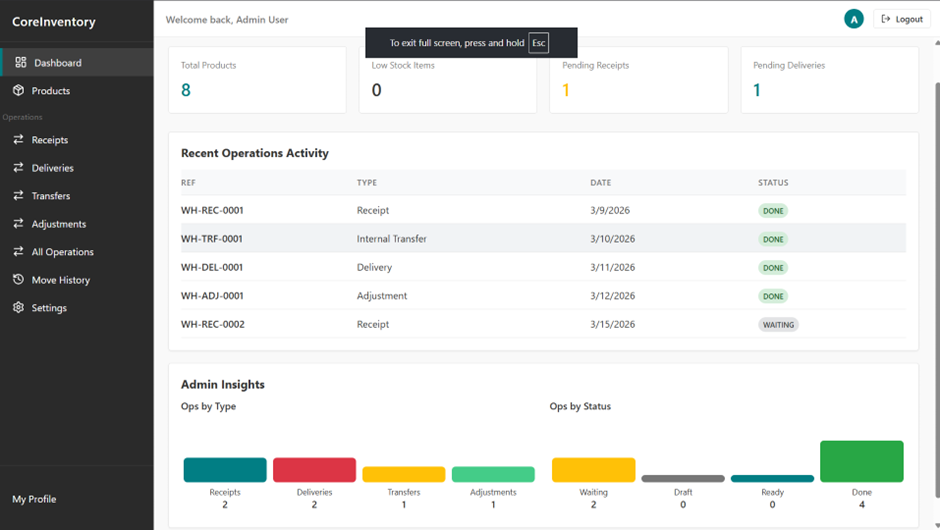
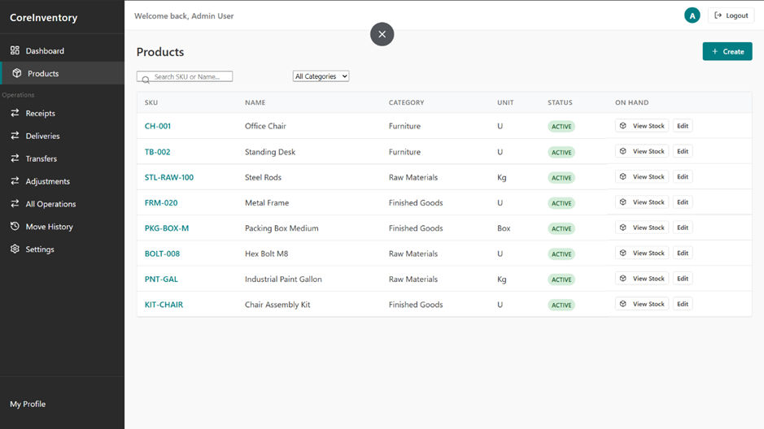
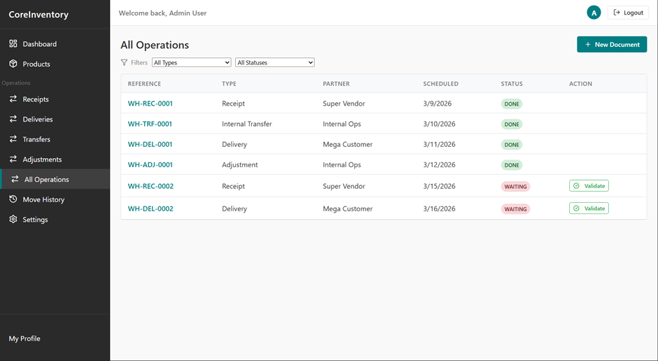

<!-- # CoreInventory

Lightweight inventory and warehouse management stack: React/Vite frontend, Spring Boot backend, PostgreSQL database. Run locally with Docker or start services separately for dev.

## Quick start (Docker)
- Requirements: Docker + docker compose
- From repo root:
	- Build & run: `docker compose up --build`
	- Stop & clean: `docker compose down -v`
- Frontend: http://localhost:5173 (proxied to backend)
- Backend API: http://localhost:8080

## Quick start (dev mode)
Frontend
- `cd frontend`
- Install deps: `npm install`
- Run dev server: `npm run dev`

Backend
- `cd backend`
- Java 17+, Maven
- Run: `./mvnw spring-boot:run` (or `mvn spring-boot:run`)

Database
- PostgreSQL with schema/seed from `database/init.sql`
- Configure connection in `backend/src/main/resources/application.properties`

## Architecture at a glance
- Frontend: React + TypeScript (Vite). Auth context manages JWT; pages fetch via `src/services/api.ts`.
- Backend: Spring Boot (REST). Controllers -> Services -> Repositories (JPA) -> Postgres. Security config handles auth/roles.
- Database: Postgres seeded with products, locations, stock documents, reorder rules.

## Directory hints
```
backend/        Spring Boot app (controllers, services, models, repos, config)
frontend/       React/Vite client (pages, components, auth context, API client)
database/       init.sql seed + schema
docker-compose.yml  Orchestrates frontend, backend, and Postgres
``` 

## Key endpoints
- Auth: `/auth/login`, `/auth/signup`
- Dashboard: `/dashboard/summary`, `/operations`
- Operations: `/operations`, `/operations/{id}/validate` (admin)
- Products: `/products`, `/categories`, `/locations`

## Notes
- Default admin/user seeds are in `database/init.sql`.
- Role-based UI hides admin-only actions for non-admin users. -->


# CoreInventory

Lightweight **Inventory & Warehouse Management System** built with:

- ⚛️ React + Vite (Frontend)
- ☕ Spring Boot (Backend)
- 🐘 PostgreSQL (Database)
- 🐳 Docker (Deployment)

The system manages **products, warehouse locations, stock movements, operations validation, and inventory insights** with **role-based access control**.

---

# 📑 Table of Contents

- [Project Overview](#project-overview)
- [System Architecture](#system-architecture)
- [Runtime Topology](#runtime-topology)
- [Tech Stack](#tech-stack)
- [Project Structure](#project-structure)
- [Quick Start (Docker)](#quick-start-docker)
- [Quick Start (Development Mode)](#quick-start-development-mode)
- [Backend Architecture](#backend-architecture)
- [Frontend Architecture](#frontend-architecture)
- [Database Design](#database-design)
- [API Endpoints](#api-endpoints)
- [Authentication & Roles](#authentication--roles)
- [Entity Relationship Diagram](#entity-relationship-diagram)
- [Screenshots](#screenshots)

---

# 📌 Project Overview

CoreInventory is a **lightweight inventory and warehouse management platform** designed to manage:

- Product catalog
- Stock movements
- Warehouse locations
- Operation validation
- Dashboard insights
- Role-based administration

It supports **Admin and User roles**, where some actions such as **operation validation and settings management are restricted to admins**.

---

# 🏗 System Architecture

The application follows a **3-tier architecture**:

```
Frontend (React + Vite)
        │
        ▼
Backend API (Spring Boot)
        │
        ▼
Database (PostgreSQL)
```

Frontend communicates with backend through **REST APIs**, while backend interacts with database using **Spring Data JPA**.

---

# ⚙ Runtime Topology

The system runs three main services using Docker:

```
Frontend (Vite React)
        │
        ▼
Backend (Spring Boot REST API)
        │
        ▼
PostgreSQL Database
```

- Frontend → HTTP requests → Backend
- Backend → JPA queries → PostgreSQL

Docker Compose orchestrates all services.

---

# 🧰 Tech Stack

## Frontend

- React
- TypeScript
- Vite
- Context API
- Axios

## Backend

- Spring Boot
- Spring Security
- Spring Data JPA
- JWT Authentication

## Database

- PostgreSQL

## DevOps

- Docker
- Docker Compose

---

# 📂 Project Structure

```
CoreInventory
│
├── backend
│   ├── controllers
│   ├── services
│   ├── repositories
│   ├── models
│   ├── config
│   └── utils
│
├── frontend
│   ├── components
│   ├── pages
│   ├── services
│   ├── context
│   └── layouts
│
├── database
│   └── init.sql
│
└── docker-compose.yml
```

---

# 🚀 Quick Start (Docker)

### Requirements

- Docker
- Docker Compose

### Run the project

```bash
docker compose up --build
```

### Stop containers

```bash
docker compose down -v
```

### Access URLs

Frontend

```
http://localhost:5173
```

Backend API

```
http://localhost:8080
```

---

# 💻 Quick Start (Development Mode)

## Frontend

```bash
cd frontend
npm install
npm run dev
```

## Backend

Requirements:

- Java 17+
- Maven

Run backend:

```bash
cd backend
./mvnw spring-boot:run
```

or

```bash
mvn spring-boot:run
```

---

## Database

Use PostgreSQL and execute schema from:

```
database/init.sql
```

Configure database connection in:

```
backend/src/main/resources/application.properties
```

---

# ⚙ Backend Architecture

The backend follows **layered architecture**:

```
Controller
   │
   ▼
Service
   │
   ▼
Repository
   │
   ▼
Database
```

### Controllers

Expose REST endpoints such as:

- Auth
- Products
- Operations
- Dashboard
- Settings

### Services

Contain **business logic**, such as:

- product management
- stock movement
- validation rules

### Repositories

Spring Data JPA interfaces that interact with the database.

### Models

Main entities include:

- Product
- Category
- Location
- StockDocument
- ProductStock
- ReorderRule
- Contact

### Security

Spring Security manages:

- JWT authentication
- role based authorization

---

# ⚛ Frontend Architecture

Frontend is built using **React + TypeScript**.

### Entry

```
main.tsx
  → App.tsx
      → Pages
```

### Layout

```
layouts/MainLayout.tsx
```

Controls navigation and layout depending on user role.

---

### Authentication Context

```
context/AuthContext.tsx
```

Responsible for:

- storing user
- storing JWT token
- protecting routes

---

### API Layer

```
services/api.ts
```

Handles:

- API requests
- authentication headers
- error handling

---

### Pages

```
pages/
```

Examples:

- Dashboard
- Products
- Operations
- Move History
- Settings
- Profile
- Login / Signup

---

# 🗄 Database Design

Database is initialized using:

```
database/init.sql
```

It creates and seeds tables for:

- Users
- Roles
- Products
- Categories
- Locations
- Stock
- Reorder Rules
- Stock Documents

---

# 🔗 API Endpoints

## Authentication

```
POST /auth/login
POST /auth/signup
```

---

## Dashboard

```
GET /dashboard/summary
GET /operations
```

---

## Operations

```
GET /operations
POST /operations
PUT /operations/{id}
POST /operations/{id}/validate
```

(Admin only)

---

## Products

```
GET /products
POST /products
GET /categories
GET /locations
```

---

# 🔐 Authentication & Roles

Authentication uses **JWT tokens**.

### Flow

```
User Login
   │
   ▼
Backend generates JWT
   │
   ▼
Frontend stores token (localStorage)
   │
   ▼
Token attached to API requests
```

### Roles

| Role | Permissions |
|-----|-------------|
Admin | Validate operations, manage settings |
User | View products, create operations |

---

# 📊 Entity Relationship Diagram

Add your ER diagrams here.

Example:

```
docs/erd.png
docs/schema.png
```

### ERD





# 🖼 Screenshots

### Dashboard



---

### Products



---

### Operations



---